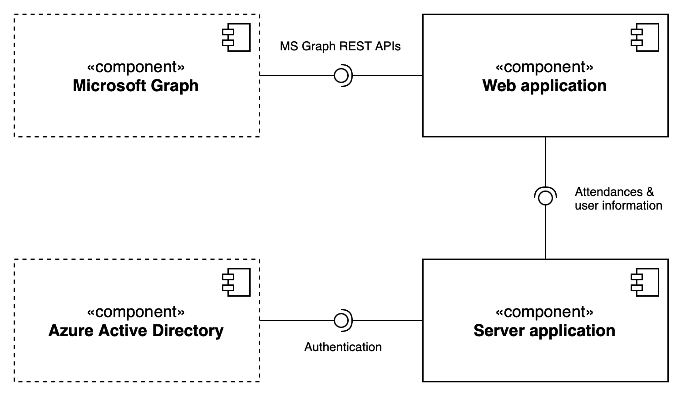

# jambu

## App overview

jambu is an office attendance planning tool. With jambu, employees can easily see the days their colleagues are expected to be in the office, enabling better collaboration and planning. The tool is designed to increase productivity and streamline the office attendance management process.

## Features

- Authentication
- See which colleagues are going to be in the office in the next weeks
- Mark days as present or absent
- Create regular attendances
- Create tags
- Mark colleagues as favorites
- Filter
    - By name
    - By tag
- Sync with Microsoft Outlook
    - Recognise present days based on calendar entries
    - Recognise absent days based on calendar entries
    - Create calendar entries for present days
    - Create separate calendars with entries for favorites and tags

## Architecture
The figure shows a UML diagram of the different components of jambu. The dashed components are external systems which, in contrast to the solid components, were not developed in-house. To enable multiple users to use the platform, jambu uses a client-server architecture. 

#### Microsoft Graph

Microsoft Graph is a platform that enables access to data and functions of Microsoft products such as Office 365. With Microsoft Graph, the web application can retrieve, create and update user information, calendars and appointments.

#### Azure Active Directory

Azure Active Directory (Azure AD) is a cloud-based identity and access management service from Microsoft. It enables organisations to manage users and groups, create identity and access management policies, and control access to applications and resources. The jambu tool uses Azure AD for authentication.

#### Server application

The server has three main tasks. Firstly, it manages and stores the user profiles and the presence and absence times. Secondly, this component is responsible for authenticating users with Azure AD. Thirdly, the server takes care of sending weekly push notifications.

#### Web application

The web application is the interface to the end users. The entire application logic is encapsulated here. To read and write the calendar appointments from Microsoft Outlook, this component interacts with the Microsoft Graph REST APIs. To store and load attendances and absences, the web application communicates with the server application.

## Used packages
- Bloc for state management
- go_router for navigation
- chopper for network requests
- video_player for playing videos
- firebase for backend
- secure_storage for storing the authentication token
- very_good_analysis for lint rules

## Todos
- [ ] Add support for offices in multiple locations
- [ ] Show week number for selected week
- [ ] Instead of only writing "Good day" display a rating from 1-5
- [ ] Add support for iOS and Android