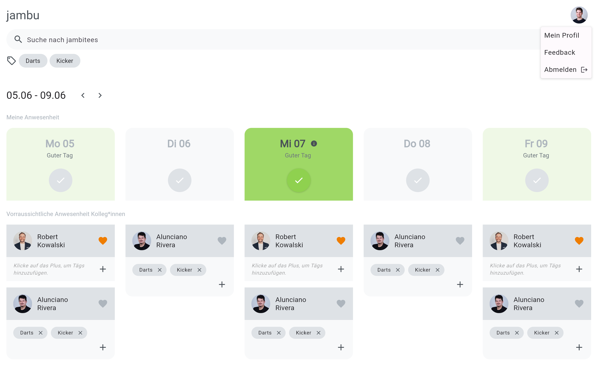

# jambu

## App overview

jambu is an office attendance planning tool. With jambu, employees can easily see the days their colleagues are expected to be in the office, enabling better collaboration and planning. The tool is designed to increase productivity and streamline the office attendance management process.

## Features

- Authentication
- See which colleagues are going to be in the office in the next weeks
- Mark days as present or absent
- Create regular attendances
- Create tags
- Mark colleagues as favorites
- Filter
    - By name
    - By tag
- Sync with Microsoft Outlook
    - Recognise present days based on calendar entries
    - Recognise absent days based on calendar entries
    - Create calendar entries for present days
    - Create separate calendars for favorites and tags

## Architecture

## Used packages
- Bloc for state management
- go_router for navigation
- chopper for network requests
- video_player for playing videos
- firebase for backend
- secure_storage for storing the authentication token
- very_good_analysis for lint rules

## Todos
- [] Add support for offices in multiple locations
- [] Show week number for selected week
- [] Instead of only writing "Good day" display a rating from 1-5
- [] Add support for iOS and Android